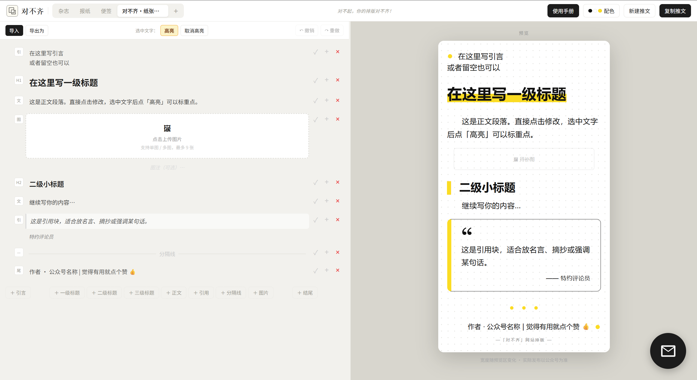

# 001 · 对不齐·纸张黄标报刊

黑黄配色、报刊大标题和纸张点阵背景的公众号排版模板。

| 信息 | 内容 |
| --- | --- |
| 模板代码 | `001` |
| 模板名称 | 对不齐·纸张黄标报刊 |
| 贡献者 / 制作者 | [Xarles-Lovell](https://github.com/Xarles-Lovell) |
| 版本号 | `1` |
| 更新日期 | `2026-09-15` |

## 文件

- [模板展示图](001_黑黄大字报.png)
- [模板 JSON 代码](001_黑黄大字报.json)

## 预览

## 使用方式

打开「对不齐」的「自定义模板」入口，上传或粘贴本目录中的 JSON 文件即可使用。
